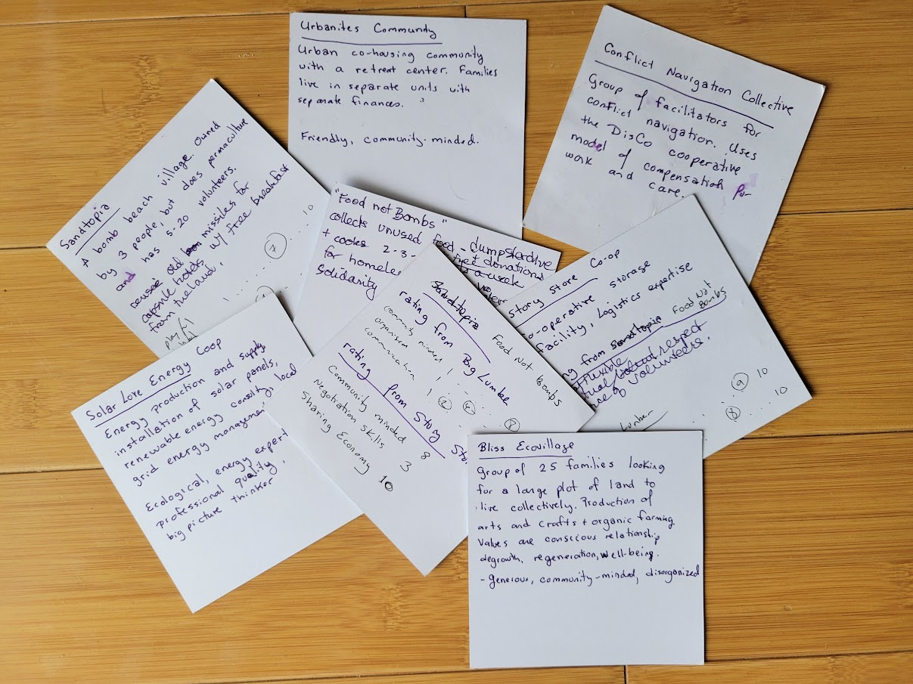
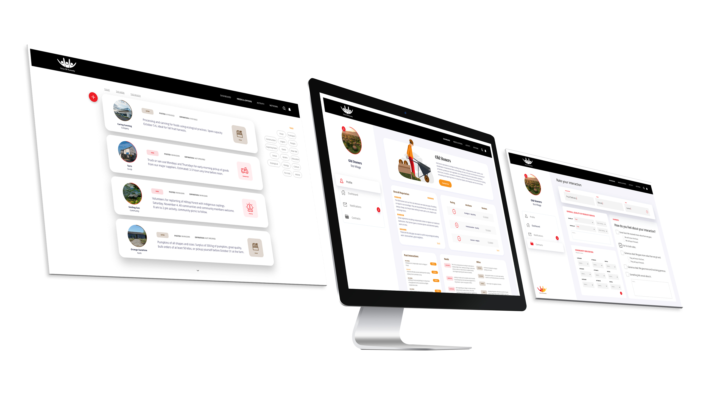
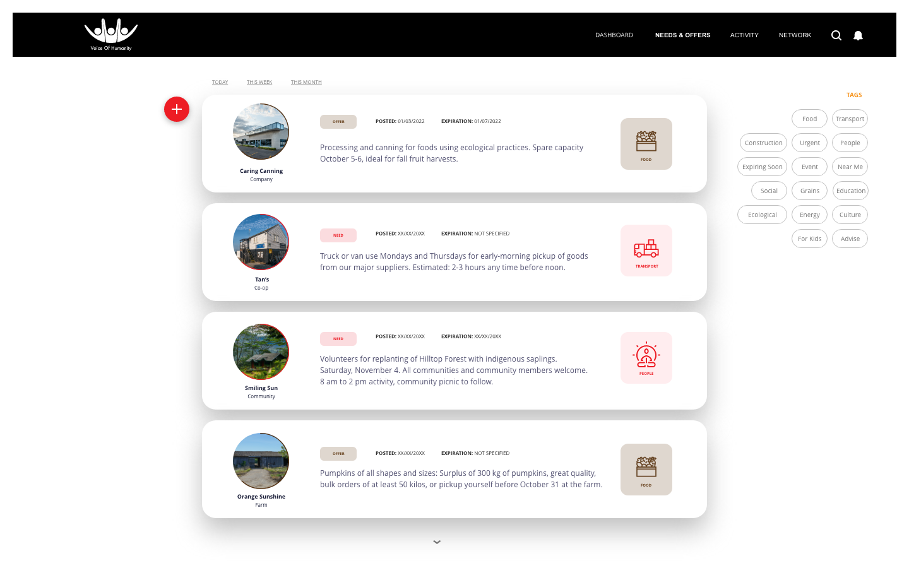
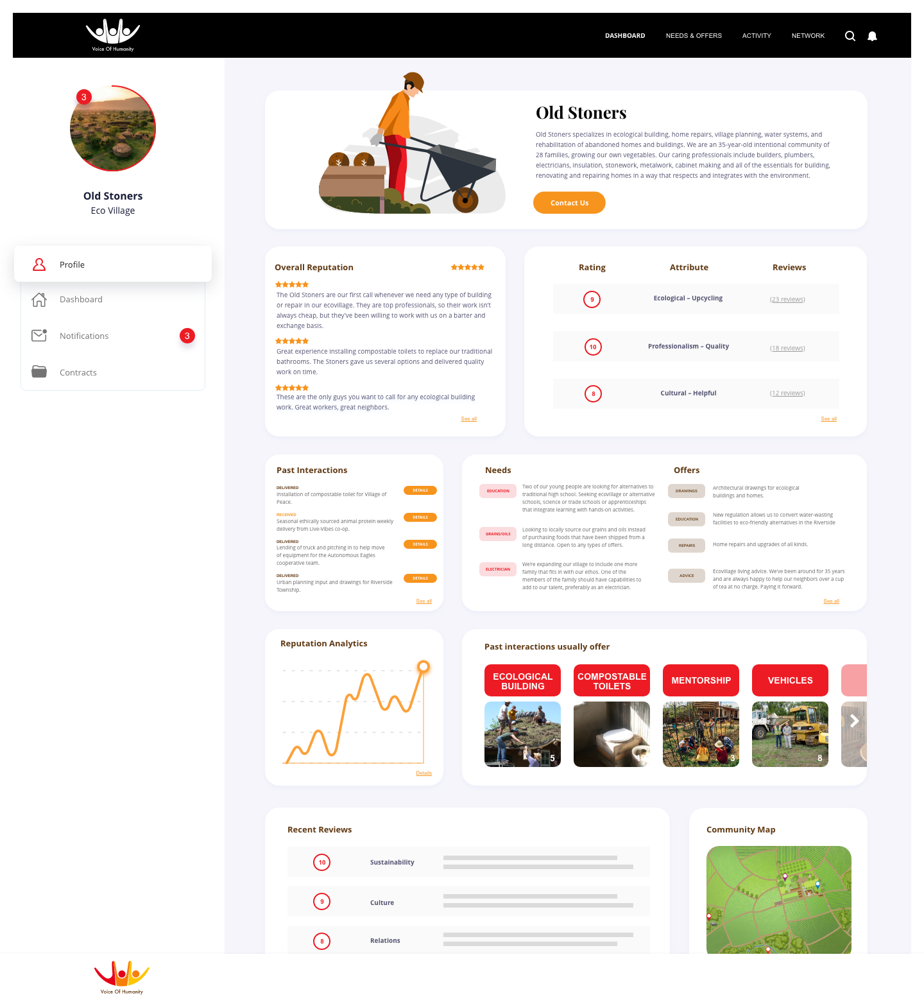

# SufficiencyEconomy
The Sufficiency Economy describes a role-playing game and a prototype for an application for a regional economy based on sufficiency and fairness.
<!-----

Conversion notes:

* Docs to Markdown version 1.0β44
* Tue Sep 02 2025 12:30:25 GMT-0700 (PDT)
* Source doc: Sufficiency Economy Game (LARP)
* This document has images: check for >>>>>  gd2md-html alert:  inline image link in generated source and store images to your server. NOTE: Images in exported zip file from Google Docs may not appear in  the same order as they do in your doc. Please check the images!

----->

# Sufficiency Economy game and app design

The Sufficiency Reputation application is designed to encourage regional collaboration for economic independence. The current economic system has failed in providing a secure supply of basic needs for people, despite the abundance in the world. With the growing recognition of the need for local production both for security and for maintaining society within ecological boundaries, the Sufficiency Economy group is attempting to prototype a new kind of economy. 

The Sufficiency Economy is based on the premises that people thrive in communities, that trust is one of the fundamental pillars of future economies, and that the purpose of an economy is to support life on the planet, starting with human life. 

The fundamental value underlying the Sufficiency Economy is simple: the first purpose of the economy should be to prevent unnecessary death, redistributing resources such as food, healthcare, and education, such that people can survive. We also care about other life forms and the planet that sustains us, but the first and most basic value we hold is that the life support system (food, water, shelter, air, healthcare) should support life.

The Sufficiency Economy is based on reputation and sharing rather than trading and exchange. While elements of exchange still exist within the economy, the principles of mutual care and group sufficiency are core to the functioning of this new economy.

Following a successful design sprint by a group of committed humans, we present this document, which outlines the basis of the next two stages of the Sufficiency Currency prototyping and trial.

1. The Community Reputation Game: A two-hour or two-day game to be played with a group of communities, cooperatives and businesses who are open to trialing the software. The game is a data-collection exercise to gather information on how people actually interact as input to development of the prototype Minimum Viable Product (MVP). 
2. MVP Development. We outline our current thinking, based on the design sprint, on the needs for the MVP. This description is the basis for estimating the development and deployment resources required and the timeline for the MVP to be available following the game.

## Credits

The Sufficiency Currency Game was developed by Vincent Arena, Liam Kurmos, Angel Matilla, Grace Rachmany, Marvin Urban, and Elis Yurtsever in the autumn of 2021 during a one-week design sprint in Prague. Extensive feedback was provided by Matthew Slater and Michael Francis.

This document was written by Grace Rachmany, with user interface designs by Elis Yurtsever**. **

## Prototyping and application

The Sufficiency Economy game was developed with the ambition to develop it into a working prototype that can be tested in real life with regional economies. Several partners were identified for potential deployment of Sufficiency Economy to supplement or replace existing software for vendor management, invoicing, and trade. 

The development team ([www.sideways.earth](http://www.sideways.earth)) is available for any of the following applications of the Sufficiency Economy game:

* Facilitation of online play with a minimum of 5 people (though you can just use these instructions for your group). Any group can play the game, as is, today.
* Training of facilitators for the online or in-person play.
* In-person full-day or two-day facilitation of the game as a LARP with 20-50 participants.
* Development of an MVP for deployment within communities. The development effort would include a launch with the LARP in the place of deployment as a user experience testing and conceptual onboarding.

# Sufficiency Economy Game 

The Sufficiency Economy game is designed to have people re-imagine what a regional economy could look like Based on principles of fairness and sufficiency, the game simulates a reputation-based sharing economy where communities share their resources and use subjective measures of reputation and fairness. The goal is to understand how we could create an economy where everyone has their basic needs met, and where local and regional culture determine systems of distribution and care. The Sufficiency Economy allows people to imagine replacements for monetary transactions that better represent their values. 

The Sufficiency Economy game has been played online and in person within the bioregional movement, the ecological movement, and among friends. Players can simulate real scenarios that they want to create in their communities, or create fully fictional scenarios. Gameplay surfaces not just economic values, but what it means to share in ways that feel fair to others in the region. In other words, the economic game emphasizes **trust** as the most important m

The game is particularly valuable in places where multiple regional groups want to work together to protect local economies from global enterprises. It’s designed specifically to represent people in groups rather than individuals. 

* Minimum time required for game: 2 hours, in-person or online
* Ideal game play: 1 full day for multiple rounds, with a second day for an Unconference (Open Space Technology) to take the learnings into actionable next steps.

# Game Play: Simple Game (2 hours)

One round of game play can be completed in 2 hours with no equipment. We have tried an Airtable but reverted to simple handwritten cards for those who want to continue beyond one round of the game. 

## Goals: how to win the game

You have won the Sufficiency Economy game if you:

* Had fun
* Learned something
* Met someone cool

For multiple rounds of the game, the goal is to increase the overall level of trust among the participating game communities.

## Gameplay: Round overview

A full round of gameplay includes six phases:

1. Each person describes the entity they represent. (For the first round only.)
2. One player takes a turn and declares their needs as an entity. 
3. The other group members create a way to fulfill the needs of the player, making unilateral or multilateral agreements.
4. The players pretend to execute the agreement, inventing a story of what happened.
5. The players give a review to one another about how they rate one or more of the other communities and entities.
6. The players talk about what they learned from the round.

The following instructions and examples of the 6 phases should be adequate for any group to play a round themselves. 

## Full round description and example

### Phase 1: Declaring the game players

Time: 15 minutes. Set a timer or declare a time keeper. It is important that everyone gets to present themselves in the round.

* Minimum recommended players: 5
* If you have fewer than 5 players, each person can pretend to play two roles. 
* If you have more than 8 players, break into groups of 4-7 people each. Each round is done within the breakout group. You can mix the breakout groups between rounds if you are playing multiple rounds.
* This phase is needed for the first round, if new players join, if someone wants to play a different role than they did at a previous round, or if you have mixed up the groups to different combinations.
* New players can join at any time by taking this step.

Phase progression.

1. Step 1: Each player declares what entity or community they represent. People should represent one of the following types of entities:
    * Co-living, intentional community, village, or other cooperative living situation.
    * Business: cooperative or service provider.
    * NGO or governmental organization.

    Keys for choosing an entity/community that will generate the most fun and learning: 

    * You can use an example of an entity or community that you actually belong to.
    * The entity should provide essentials like food, building services, food processing, textiles, recycling/upcycling, municipal services, transportation. The game is about “sufficiency”. (People sometimes break this rule, which can also be a learning experience.)
    * Preferably, choose a values-aligned organization. We have had fun games with players representing companies attempting to greenwash, so you can be flexible here, as long as most of the player entities are values-aligned.
    * For many people, it’s easiest to create their game play based on an organization they are familiar with. 
    * People can play more than one entity if they would like. During the actual game play, not all entities are involved. \

2. Everyone describes the entity or community they represent (short description) within their group of 5-6 players. At this point, they do not describe needs or offers. 

Once all players have been declared, the players can move to the next step. If you are playing with break out groups, the groups play all steps together and can mix between rounds.

**Example:** The Old Stoners are an intentional community of 30 families living together over the past 25 years. The Stoners specialize in ecological building, repurposing of materials, low-energy use housing, compostable toilets, and other types of ecological building and repair projects. As an experienced community the Old Stoners often advise other communities on aspects of coliving as well as providing consulting and services around village planning and construction.

### Phase 2: Choosing a need to fulfill

Time: 15 minutes. Generally, this will take less time and it will flow naturally into the next phase. \

In this phase, one player takes a “turn” and declares their needs, or their intention to create an activity aligned with one or more of their needs. The other players can respond to any of the declared needs of the player based on their ability to contribute.

* If none of the players want to fulfill any of the needs of the player, the next player takes a “turn” declaring their needs or intentions. This results in more learning, but it feels awkward, so the “less fun” penalty balances out the “more learning” bonus. Not that anyone is keeping score. \

* If more than one of the players can fulfill the need, or if there is a multilateral exchange required to fulfil the needs, the game is more fun!

Once it is clear that a negotiation has started, the group has moved into Phase 3..

**Examples:**

* The Shroomers powdered mushroom packaging facility has extra capacity and a need for new clients and more sales of mushroom powders. Crunchies Cafe has been thinking of canning their famous pesto, so they can work with Shroomers on packaging and preserving pesto.
* The Dalton-on-Tee municipality is looking to re-purpose an old industrial zone that has been abandoned by industry. The Old Stoners would be happy to help provide urban planning ideas, and clear the area in return for being able to reuse the old materials.
* The Bliss Ecovillage community wants to get to know the neighbors and they are arranging a river cleanup and potluck activity for the communities nearby. Everyone is happy to attend.

### Phase 3: Creating the fulfillment proposal

Time: 20 minutes. Set a timer or name a timekeeper. 

In this phase of the round, all of the players can participate in negotiating a way to fulfill the needs. This is where the fun and creativity happens. Instead of the “normal economy” where people just pay for services, communities find they have much more to offer than just monetary transactions. Often multi-lateral transactions happen. 

If the time is up before you complete all of the negotiations, just quickly make up a declaration of the agreement. (It’s a game, don’t try to get it perfect.)

**Example: **Crunchies Cafe and the Shroomers made a complex agreement, including Bananarama. Crunchies Cafe will work with Shroomers to can their pesto and their famous fig jam, and returning 15% of their sales income to Shroomers. Crunchies will also offer the Shroomers mushroom powder at their cafe. Together, they will host a soiree at Crunchies, highlighting the new products as well as the Shroomers’ mushroom coffee. Bananarama will invent some smoothies using the Shroomers’ mushroom powder, and feature the smoothie offerings as well. All of the other players are invited to the soiree. 

### Phase 4: Invent a story of how it went

Time: 20 minutes. Set a timer or name a timekeeper. 

Improvise what happened. Make up a story. It might go differently than what you imagined, but use improv “Yes, and…” to just go with the flow as you all make up a story together. It’s a game, not your real reputation, so don’t sweat it. 

**Example:** At the soiree, everyone had a good time. The Bohegans brought dogs, which aren’t allowed in the cafe, so that was annoying, but other than that the event was a big hit. Crunchies Cafe, as usual, was organized, many community members came, and the food was great. The pesto and jam were canned on time, and Crunchies kept to their agreements regarding the profit sharing and display of products. During the soiree, Big Lumber found out that the Shroomers were having trouble managing their bookkeeping, and offered to send over their accountant once a week to help the Shroomers get their books in order. (Big Lumber is the greenwasher in the story, and they often offer free help to the others in the community.)

### Phase 5: Review one another

Time: 15 minutes. Give each reviewer up to 3 minutes to review one or more of the other players’ entities.

Each participant invents their “opinion” of the performance of at least one of the other participants in the activity. The review is verbal (no forms to fill out) and should include:

* Did it feel fair or “cool”?
* What were the outstanding qualities of the other participant (good or bad outstanding qualities).

**Examples:** 

* Crunchies Cafe said that the Shroomers were extremely knowledgeable about how to safely package the pesto, what types of jars and tops to use, and how to ensure preservation of the flavor and color. The labels were a little crooked sometimes, but that just made the product look more organic and natural. They felt the exchange was fair and that the Shroomers were generous in partnering on the soiree. They also noted that the Shroomers were extremely honest about their own strengths and weaknesses, and therefore they had no surprises in the process. 
* Big Lumber said the evening activity was great and the hosts were gracious and fun to be around, even though they were kind of hippies. The coffee from the Shroomers was disgusting but the smoothies were great. They enjoyed the ambiance and great hosting of Crunchies Cafe and said everything was orderly and perfect. 

### Phase 6: Learnings and takeaways

For the remaining time, the participants share how the experience was for them, what it was like to play the roles, what they learned, what could be brought into their own communities, etc.

# Preliminary specifications for application prototype 

The specifications below are preliminary, based on initial research with communities of place. We envision having several one-day game plays prior to beginning development of the application, in order to adjust the specifications for a prototype or MVP specifically designed for a region that has played a few one-day simulation games. 

## Group Transactions (no individual economic activity)

Sufficiency Economy focuses on groups as the fundamental module of human interaction. In the initial app and game, individuals cannot transact without being part of a group. Fundamentally, this is always true. The movement of goods within any economy is meaningless without the group itself, and the money used for transactions is good only because it is issued by a trusted authority that represents a group. 

For the purposes of a Sufficiency Economy, the group serves the following purposes:

* Creation of social norms. Small groups prevent narcissism and sociopathy. Dependence on a group sets standards of behavior. People can belong to multiple groups and choose their groups, but no matter what group they choose, each group holds members to a particular set of norms.
* Caring for the weak members of the group. In a group with a shared interest, the members of the group can see the difference between a free rider and someone who is going through a tough time. Inside a group where people know one another, people generally don’t let one another starve.
* Reputation sharing. Group reputation incentivizes everyone to behave according to the norms, not just of their group, but the norms of interaction that will maximize the reputation of their group in the economy.

# The App

The Community Sufficiency App (temporary name) foresees reputation as the “currency of the future”, with people and communities providing resources to one another based on values alignment and reputation, rather than through interactions that are purely financial and transactional in nature. It is designed for a local regional economy, for groups looking to prioritize ecological and societal returns rather than financial returns.

The application will be designed with the following purposes in mind:

* Building regional self-sufficiency.
* Supporting people through communities rather than through money or bureaucratic structures.
* Re-establishing social norms and culture to create a more humane society and economy.
* Creating a workable alternative to the existing default economy.

The initial app allows interactions (sharing, transactions, social actions) based on community participation. Communities interact with one another based on their needs, resources and aspirations. As the communities interact, they rate one another on different values, and each community develops a reputation that is the basis for their future interactions.

## Target Audience

The app will be designed for the use of one or maybe a few people in an organization. You could think of that as something like the “Purchasing Manager”. Individuals will not be able to participate on their own behalf, but only as representatives of an organization (initially). We envision individual reputations in the future, but the initial application is designed for group-to-group interactions. A group might be:

* An intentional community or ecovillage
* A cooperative
* A company
* An NGO
* A local governing body such as a municipality
* A clinic or healthcare organization (future)
* An educational institution
* A utility, such as an internet provider or clean energy grid company
* A hackerspace

The ideal is for the groups to work together to create an economy that is as independent as possible from outside needs. 

Generally speaking, groups can be Sustenance Communities or not, where a Sustenance Community is one that provides for the well-being of its members, like an intentional community. If someone belongs to a Sustenance Community, they have access to shelter and food no matter what their financial situation. The goal of the economic system is to ultimately make sure that everyone has a community that cares for them.

By identifying one person in every community that uses the Community Sufficiency App, we reduce the number of direct users for our initial deployments, while reaching a much larger audience. In the prototyping phase, we anticipate 20-50 communities in a region, which is a very manageable number of actual users—while having a reach to hundreds of people. 

## How It Works

The app is constructed around a needs-based market. At surface level, the app seems like any other type of needs marketplace, but it has several key differences:

* Focus on basic needs rather than nice-to-have items, artisan products, etc. 
* Interaction, rather than transaction, is the default. Negotiations to meet needs are based on a solidarity economy philosophy, such that needs should be met with a minimum of monetary exchange. 
* Multi-organizational interactions are encouraged for built-in circular economy and collaboration.
* Interactions such as community events are part of the economy. 
* Measurement of interactions is not in monetary value, but in trust, represented by “coolness”. That is, the subjective sense of the parties involved that the interaction was good and fair. (Trust among the parties is strengthened rather than weakened.)

Monetary transactions are allowed in any currency agreed upon by the parties, but the app is designed to reward accumulation of positive trust, rather than a bottom-line measurement. Trust is subjective, but ultimately it is the only thing that matters in terms of forming a local economy. If communities can rely on one another’s care, they can potentially free themselves from global supply chains. Although they may sacrifice some level of convenience, they will be rewarded with more resilience in the face of changing social and climate situations.

The needs and offers field shows the basic information about what communities offer, but it gets interesting because in addition to products and services typically for sale, communities make other types of offers, such as organizing a picnic or beach cleanup, lending out their truck on the weekends, etc. When a group decides to act on the offer or need of another group, the system leads them through a path to speak to the other group and find ways to interact without money, either in a barter situation, pay-it-forward, circular exchange or return-the-favor later. As they have real conversations with neighbors in their region, the communities increase their value to one another.

The main “currency” that is exchanged is a measure of trustworthiness. During and following the interactions, communities rate one another on the fairness and quality of the transaction. This maps back to how humans interact. If a farm has extra food, they might give it to any human who is hungry; but if they have an extra truck, they would only lend it to someone who is a good player in the community and has a good reputation for caring for the items they borrow and who will use it for a good cause (not to log the trees, for example). 

For the prototype, we expect people to simply use voice recordings to review the transactions. We can process these with speech-to-text, large language models, and manual listening to the reviews. Over time, we will be able to train an LLM to understand and interpret these voice recordings into trust scores, similar to the reviews we now see online, where Google reviews indicate the keywords most often mentioned. 

The main flow is:

1. Identification of an offer or need that your community wants to fulfill. 
2. Review of the offer or need and the reputation of the community that is making the offer or need. 
3. If it is a good match, set up a voice call or meeting with the other community to discuss the details of the interaction.
4. If yes, one side creates a proposed contract which includes all the elements of the transaction. It’s possible to create multi-party transactions as well. 
5. The other side can agree or counter-offer. Once both sides agree, the contract is created.
6. Each side rates the other side on the interaction to date (offer, fairness, discussion, negotiation).
7. Execute the contract / make the transactions agreed upon.
8. Rate one another regarding the actual transaction.
9. Other parties can also rate the transaction (which shows in their news feed). The example below is an example where other parties are influenced by the interaction and therefore might want to rate the parties involved. 

Example (from our design sprint brainstorm): A local municipality zoned a parcel of land for a new neighborhood. They needed to clear the space and create a neighborhood and architectural plan for the space. One of the nearby eco-communities (named The Old Stoners) was a group of architects and builders who specialize in environmentally-friendly/green building. The community volunteered to clear the area, so they could acquire the material for upcycling, and they volunteered architectural plans that would create environmentally-friendly buildings using green energy and preserving green spaces. In return, The Stoners asked the municipality to push for regional regulation approving the use of compostable toilets, one of the big issues for all of the ecovillages and environmentally conscious individuals in the region—as well as themselves. Everyone got something they wanted, but no money changed hands. They each rated one another for the interaction, and so did some of the other communities. The Stoners were rated by both the municipality and the communities as having strong positive social and environmental values, but also as being shrewd and aggressive in their negotiations. 

In this example, we see how an interaction can benefit not just those in the “deal” but also the community at large. It also shows an element of the interaction which would not have been listed as an “offer” of the municipality—support for regional legislative change—but it was identified in the negotiation as a valuable part of the interaction. 

In the current economy, many transactional and monetary deals have negative influence on other parties, but other than taking legal action after the fact, the public has no power in these dealings. In this application, communities are dependent on their reputation among all of the communities in the region, and the transactions are generally transparent (we envision future features for private interactions, but expect those to be discouraged by the neighbors). This non-financial economic structure is designed to incentivize communities to improve their reputation among their neighbors. The “price” of the example transaction was that the community thought of them as aggressive, but they also saw them as defending the greater good. Unlike every other gamification and blockchain program you’ve read, we aren’t incentivizing people with money, “likes”, or meaningless gold stars. The incentive is a long-term, more natural incentive: societal acceptance and respect. Moving the incentive model towards societal acceptance means that people are working towards group rather than individual objectives, and avoiding anti-social behaviors such as excessive hoarding, self-aggrandizing, polluting, or selfishness.

The image above shows a community profile. The interactions, needs and offers represent many interactions that would not show in the default economy. This economy is designed to show all value-adding activities among communities. Having a picnic together, giving free advice, or even failing to reach an agreement are all activities that involve people’s time and creating or destroying value in the economy. By representing long-term value in the form of reputation, the system accounts for much more than transactional value. It also allows any community to start from nothing and earn reputation by any action. Entering a shop and looking around—even if you don’t buy something—is an interaction that forms your reputation of the place. If the shop gives you a taste of their goods, you’ll also form an opinion of their reputation. This economic system allows (but doesn’t force) the formation of reputation based on those types of actions, allowing a multitude of ways for any group to enter into the system.

## Summary

Sideways.earth currently has connections with several communities willing to start the initial process and is seeking funding for further developments.
